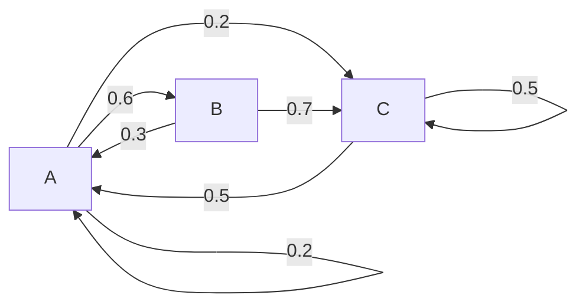

# HMM related resources

## Markov chains brief explanation

$P(X_{n+1} = x | X_{1} = x_{1}, X_{2} = x_{2}, ..., X_{n} = x_{n})$

Markov chain is that the future state depends only on the current state, not the steps before.

Means the following:

$P(X_{n+1} = x | X_{n} = x_{n})$

For example:



Suppose we have a Markov chains model like this.

$P(X_{4} = C | X_{1} = B, X_{2} = A, X_{3} = B)$

According to previous step, it only depends on the current state.

$P(X_{4} = C | X_{3} = B)$

$P(X_{4} = C | X_{3} = B) = 0.7$

It turns out to be 0.7. (C happens when B has happened already).

That is the Markov property.

Random Walk:

A -> B -> A -> C -> A -> C -> C -> C -> A -> B

Q: What is the probability distribution of the states?

A: It is occurrences of an item by the total number of days.

$P(A) = \frac{4}{10}$, $P(B) = \frac{2}{10}$, $P(C) = \frac{4}{10}$

Q: What will happen in the long term?

A: The stationary distribution or the equilibrium state.

Using linear algebra to find equilibrium state. Transform the above HMM model into a matrix.

$$
\begin{array}{c|ccc}
{} & {A} & {B} & {C} \\
\hline
{A} & 0.2 & 0.6 & 0.2 \\
{B} & 0.3 & 0 & 0.7 \\
{C} & 0.5 & 0 & 0.5
\end{array}
$$

This is called the transition matrix.

$$
A = \left[\begin{matrix}
0.2 & 0.6 & 0.2 \\
0.3 & 0 & 0.7 \\
0.5 & 0 & 0.5
\end{matrix}\right]
$$

$$
\pi_{0} = \left[\begin{matrix}
0 & 1 & 0
\end{matrix}\right]
$$

This row vector means the B happens at the first time.

After calculating:

$$
\pi_{0}A = \left[\begin{matrix}
0 & 1 & 0 \\
\end{matrix}\right]
\left[\begin{matrix}
0.2 & 0.6 & 0.2 \\
0.3 & 0 & 0.7 \\
0.5 & 0 & 0.5
\end{matrix}\right]=
\left[\begin{matrix}
0.3 & 0 & 0.7 \\
\end{matrix}\right]
$$

We get the following row vector:

$$
\pi_{1} = \left[\begin{matrix}
0.3 & 0 & 0.7
\end{matrix}\right]
$$

This is just the future probabilities after B has happened.

Then repeat this:

$$
\pi_{1}A = \left[\begin{matrix}
0.3 & 0 & 0.7
\end{matrix}\right]
\left[\begin{matrix}
0.2 & 0.6 & 0.2 \\
0.3 & 0 & 0.7 \\
0.5 & 0 & 0.5
\end{matrix}\right]=
\left[\begin{matrix}
0.41 & 0.18 & 0.41
\end{matrix}\right]
$$

So if there is a stationary state, we have the following

$$\pi A = \pi \tag{1}$$

The eigenvector(特征向量) equation.

And:

$$\pi [1] + \pi [2] + \pi [3] = 1 \tag{2}$$

Then after solving those two equations (1) and (2):

$$\pi =
\left[\begin{matrix}
{\frac{25}{71}} & {\frac{15}{71}} & {\frac{31}{71}}
\end{matrix}\right]
$$

This is the stationary state.

## PFAM-A

```bash
mkdir -p ~/data/HMM/PFAM
cd ~/data/HMM/PFAM

for basename in Pfam-A.hmm Pfam-A.hmm.dat active_site.dat; do
    wget -N --content-disposition ftp://ftp.ebi.ac.uk/pub/databases/Pfam/releases/Pfam32.0/${basename}.gz
    wget -N --content-disposition ftp://ftp.ebi.ac.uk/pub/databases/Pfam/releases/Pfam32.0/${basename}.gz
    wget -N --content-disposition ftp://ftp.ebi.ac.uk/pub/databases/Pfam/releases/Pfam32.0/${basename}.gz
done
# wget: a non-interactive network retriever
# -N/--timestamping: don't re-retrieve files unless newer than local
# --content-disposition: honor the Content-Disposition header when choosing local file names (EXPERIMENTAL)

for basename in Pfam-A.hmm Pfam-A.hmm.dat active_site.dat; do
    echo "==> ${basename}"
    gzip -dcf ${basename}.gz > ${basename}
done
```

## TIGRFAM

TIGRFAM is a database of protein family definitions. Each entry features a seed alignment of trusted representative sequences, a hidden Markov model (HMM) built from that alignment, cutoff scores that let automated annotation pipelines decide which proteins are members, and annotations for transfer onto member proteins. Most TIGRFAMs models are designated 'equivalog' (genes, or the proteins they encode, that are conserved in function since their last common ancestral sequence), meaning they assign a specific name to proteins conserved in function from a common ancestral sequence.

```bash
mkdir -p ~/data/HMM/TIGRFAM
cd ~/data/HMM/TIGRFAM

wget -N --content-disposition ftp://ftp.jcvi.org/data/TIGRFAMs/14.0_Release/TIGRFAMs_14.0_HMM.tar.gz

mkdir -p HMM
tar --directory HMM -xzvf TIGRFAMs_14.0_HMM.tar.gz TIGR02013.HMM
tar --directory HMM -xzvf TIGRFAMs_14.0_HMM.tar.gz TIGR00485.HMM
```

## 40 single-copy genes

The protocol takes all the proteins in all the genomes under consideration and, using rapid searching and clustering algorithms, generates protein families from that complete protein set.

This systematic approach reveals 40 PhyEco marker candidates spanning the domains of bacteria and archaea.

Ref.:
1. [PLoS One, 2013, 8(10): e77033](https://journals.plos.org/plosone/article?id=10.1371/journal.pone.0077033)

```bash
mkdir -p ~/data/HMM/scg40
cd ~/data/HMM/scg40

curl -LO https://ndownloader.figshare.com/files/3093482

tar xvfz 3093482
```

## 120 bacterial proteins `bac120`

Ref.:
1. [Nature Microbiology, 2017, 2: 1533-1542](https://www.nature.com/articles/s41564-017-0012-7)
2. [Nature Biotechnology, 2018, 36: 996-1004](https://www.nature.com/articles/nbt.4229)

The article published on Nature Microbiology introduced their discovery that using genomes retrieved from metagenomics could find those 

```bash
mkdir -p ~/data/HMM/bac120
cd ~/data/HMM/bac120

cp ~/Scripts/withncbi/hmm/bac120.tsv ~/data/HMM/bac120/

mkdir -p HMM

# TIGR
cat ~/Scripts/withncbi/hmm/bac120.tsv |
    sed '1d' |
    tsv-select -f 1 |
    grep '^TIGR' |
    parallel --no-run-if-empty --linebuffer -k -j 4 '
        tar --directory HMM -xzvf ../TIGRFAM/TIGRFAMs_14.0_HMM.tar.gz {}.HMM
    '

# PF
cat ~/Scripts/withncbi/hmm/bac120.tsv |
    sed '1d' |
    tsv-select -f 1 |
    grep -v '^TIGR' |
    parallel --no-run-if-empty --linebuffer -k -j 4 '
        curl -L https://pfam.xfam.org/family/{}/hmm > HMM/{}.HMM
    '
```

TIGR represents the whole length protein.

PF represents the short domain.

